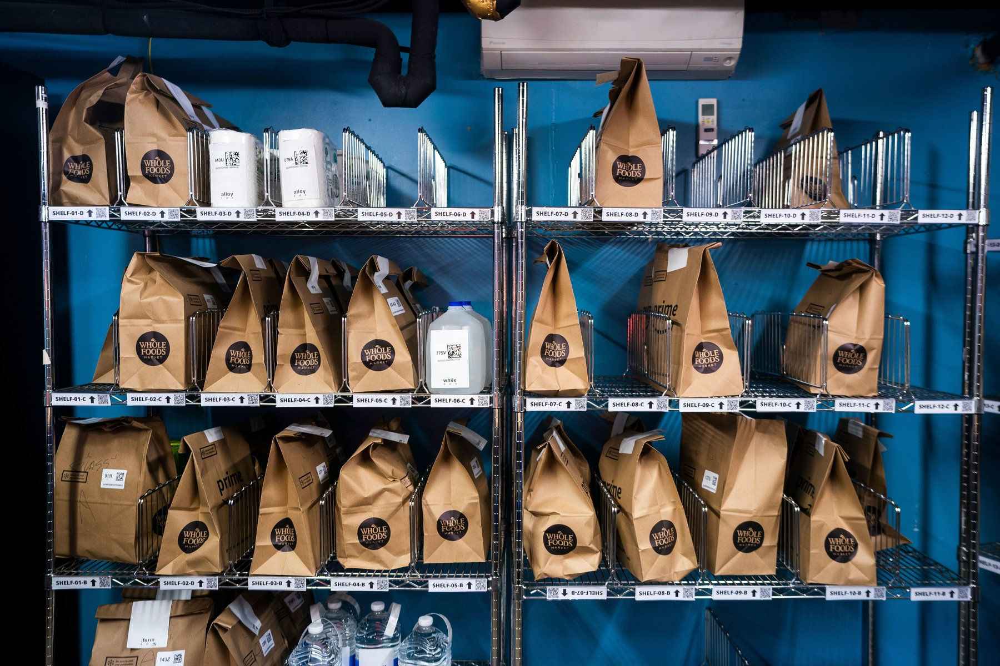

= Kitchen Delivery Simulation
:doctype: book
:toc:
:toclevels: 5
:sectnums:

== Problem Definition

Build a real-time system that emulates the fulfillment of delivery orders for a kitchen.

* The kitchen should receive 2 delivery orders per second.
* The kitchen should instantly cook the order upon receiving it, and then place the order on the best-available shelf (see _Shelves section_ ) to await pick up by a courier.
* Upon receiving an order, the system should dispatch a courier to pick up and deliver that _specific_ order.
* The courier should arrive _randomly_ between 2-6 seconds later.
* The courier should instantly pick up the order upon arrival.
* Once an order is picked up, the courier should instantly deliver it.

You can use any programming language, framework, and IDE you'd like; _however_ , we *strongly discourage* the use of microservices, kafka, REST APIs, RPCs, DBs, etc due to time constraints.

== Orders

You can download a JSON file of food order structures from http://bit.ly/css_dto_orders[`http://bit.ly/css_dto_orders`].

* Orders must be parsed from the file and ingested into your system at a rate of 2 orders per second.

* You are expected to make your order ingestion rate configurable, so that we can test your system's behavior with different ingestion rates.
* Each order should only be ingested once; when all orders have been consumed, your system should terminate.

=== `orders.json`

NOTE:

* `temp`: referred shelf storage temperature
* `shelfLife`: Shelf wait max duration (seconds)
* `decayRate`: Value deterioration modifier

Example:

[source,JSON]
----
[
  {
    "id": "0ff534a7-a7c4-48ad-b6ec-7632e36af950",
    "name": " Cheese Pizza",
    "temp": "hot",
    "shelfLife": 300,
    "decayRate": 0.45
  }
]
----

== Shelves

The kitchen pick-up area has multiple shelves to hold cooked orders at different
temperatures.

* Each order should be placed on a shelf that matches the order's
temperature.
* If that shelf is full, an order can be placed on the overflow shelf.
* If the overflow shelf is full, an existing order of your choosing on the overflow
should be moved to an allowable shelf with room.
* If no such move is possible, a random order from the overflow shelf should be
discarded as waste (and will not be available for a courier pickup).

The following table details the kitchen's shelves capacity:

* *Hot*: 10
* *Cold*: 10
* *Frozen*: 10
* *Any temperature*: 15

=== Value

Orders have an inherent value that will deteriorate over time, based on the order's `shelfLife` and `decayRate` fields. Orders that have reached a value of zero are considered wasted: they should never be delivered and should be removed from the shelf. Please display the current order value when displaying an order in your system's output.

=== Order Value Formulae

The following is the formulae to compute the value of the order.

NOTE: this is only possible when an order is placed onto the shelf, since the `shelfDecayModifier` depends on the shelf the order sits on.

[source,ruby]
----
(shelfLife - (decayRate * orderAge * shelfDecayModifier))  / shelflife
----

== Grading Rubric

You are expected to build a system to handle the above scenarios that fulfills each element of this grading rubric to the best of your ability.

* Meets all specified requirements from ​Challenge Prompt​ above

* Is valid runnable code​ ​(via CLI or within your IDE)

* Has appropriate usage of design patterns, concurrency, and data structures

* Has extendable architecture

* Has console or log output that allows ​interviewers to ​clearly understand and follow your system's operations​ ​as it runs in real-time​. Whenever events occur in your system​ (order received, picked up, discarded, etc)​, your system should output a message containing ​both ​a description of the triggering event​ and a ​full listing of shelves`' contents​.

* Has comprehensive unit testing​ (covers all major components and flows)

* Has production-quality code cleanliness

* Has production-quality docs on all public functions​ (as if someone had to work with your code)

* Has a README file that contains instructions on how to run and test your code in a local environment

* A description of how and why you chose to handle moving orders to and from the overflow shelf

* Any other design choices you would like the interviewers to know

NOTE: There is no specific guidance on how long you should spend. Similar to working in industry, what matters is the completeness and quality of your submission regardless of how quickly you complete. We've seen quality submissions done in an afternoon, while other candidates take longer based on their pace. Please focus on meeting the grading rubric above (no need for more than that).
