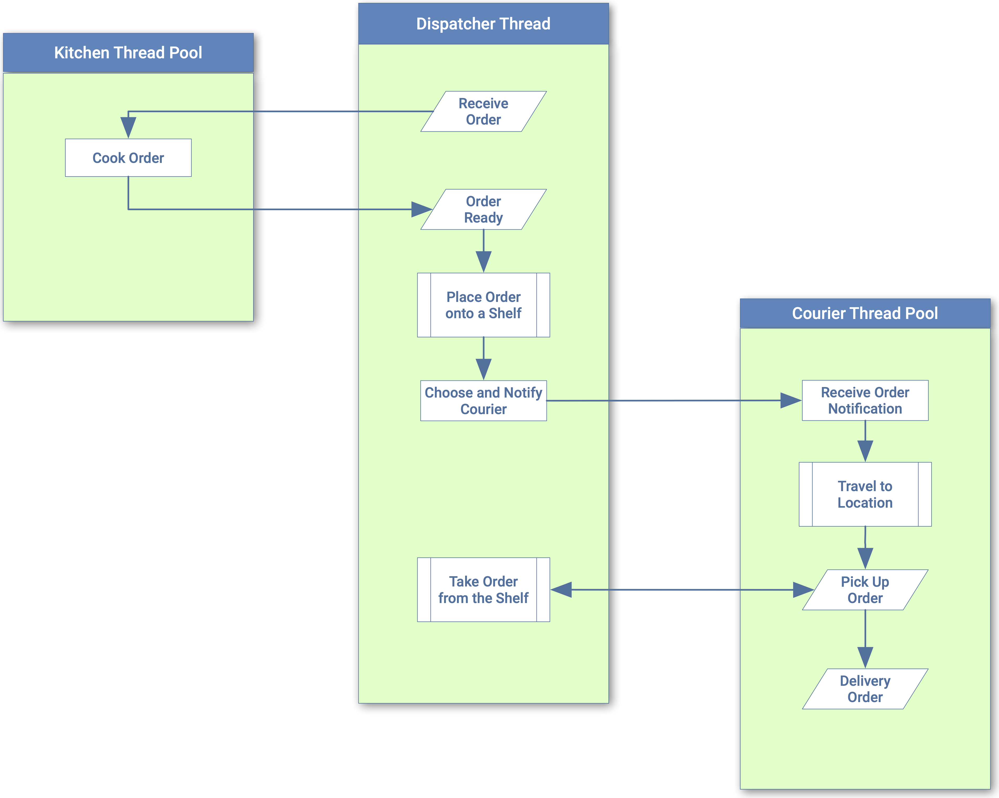

= Cloud Kitchens Dispatch
:doctype: book
:toc:
:toclevels: 5
:sectnums:

image:https://github.com/kigster/cloud-kitchens-dispatch/workflows/Ruby/badge.svg?branch=master[Build Status]
image:https://github.com/kigster/cloud-kitchens-dispatch/workflows/Rubocop/badge.svg[Rubocop Status]
image:https://codecov.io/gh/kigster/cloud-kitchens-dispatch/branch/master/graph/badge.svg?token=IASOaLWXsT[Coverage,link=https://codecov.io/gh/kigster/cloud-kitchens-dispatch]

== Design

=== Structure

image:design/uml-structure.png[UML Structure,border=2]

=== Sequence

== License

© 2020 https://reinvent.one/[ReinventONE, Inc.].
Read xref:LICENSE.adoc[LICENSE] for details.

== Credits

Developed by http://kig.re/[Konstantin Gredeskoul] at
https://reinvent.one/[ReinventONE, Inc.].
