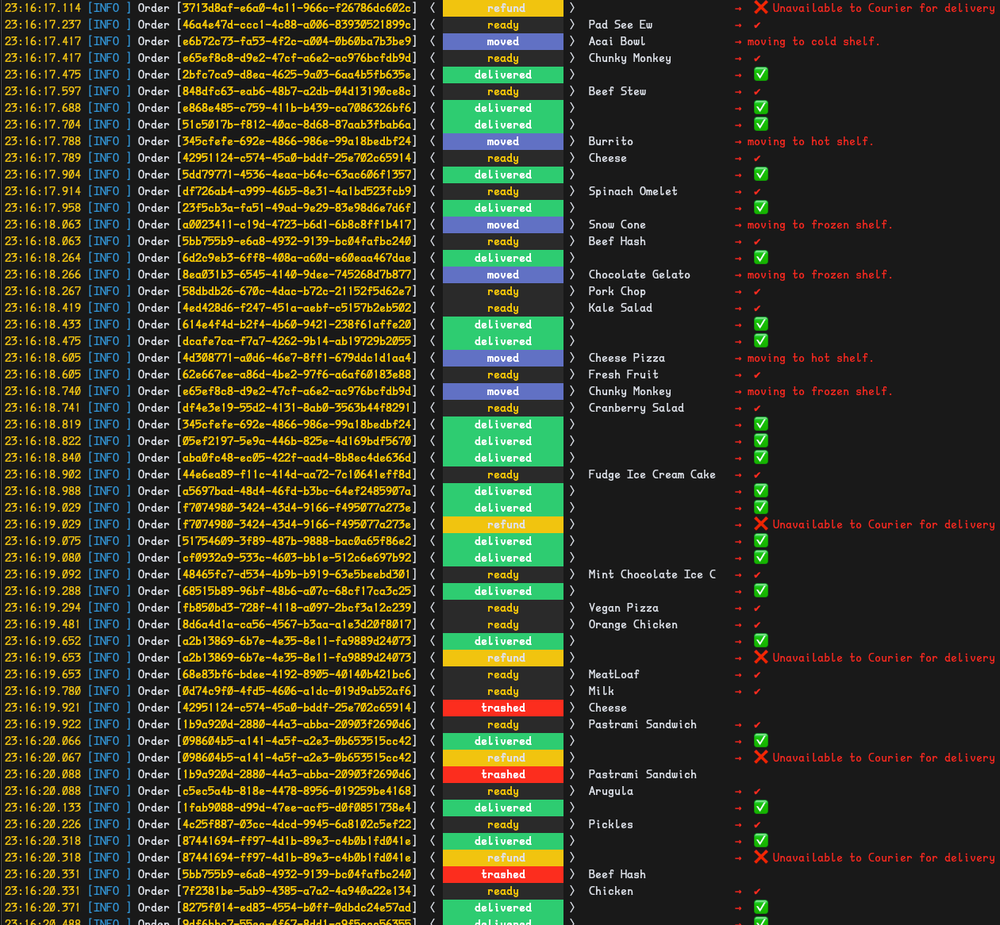
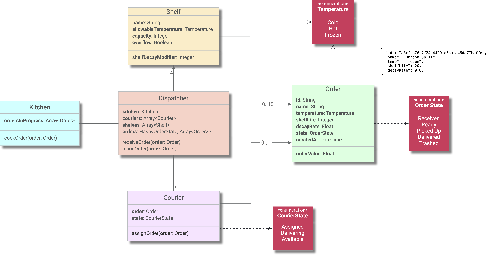
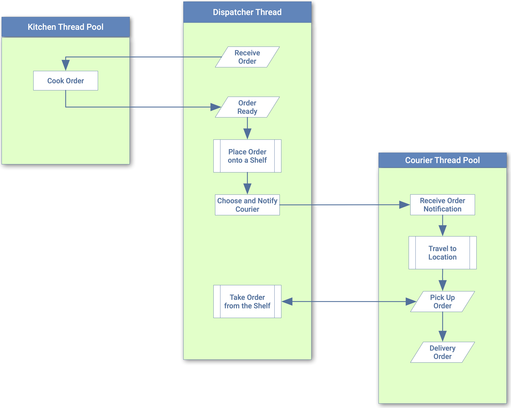

= Kitchen Order Dispatch Simulation
:doctype: book
:toc:
:toclevels: 5
:sectnums:
:allow-uri-read:
:safe: unsafe

== Build Status

image:https://github.com/kigster/kitchen/workflows/RSpec/badge.svg[RSpec,link=https://github.com/kigster/kitchen/actions?query=workflow%3ARSpec]
image:https://github.com/kigster/kitchen/workflows/Simulation/badge.svg[Simulation,link=https://github.com/kigster/kitchen/actions?query=workflow%3ASimulation]
image:https://github.com/kigster/kitchen/workflows/Rubocop/badge.svg[Rubocop,link=https://github.com/kigster/kitchen/actions?query=workflow%3ARubocop]

== Code Coverage

image:https://codecov.io/gh/kigster/kitchen/branch/master/graph/badge.svg[Coverage,link=https://codecov.io/gh/kigster/kitchen]

image:https://codecov.io/gh/kigster/kitchen/branch/master/graphs/sunburst.svg[Coverage Map]

== Problem Definition

We've captured the constraints and requirements of the xref:PROBLEM.adoc[problem in this document].

== Using It

=== Requirements

 * Ruby 2.7+ is ideal, but Ruby 2.6+ is accepted.

=== Running via the Script

Top level folder has a BASH script `./run.sh`. Go ahead and run it:

[source,bash]
bash ./run.sh

The script does the following steps:

 * Validates the Ruby version is at least 2.6+=
 * Installs Bundler gem
 * Installs the rest of the dependent Ruby Gems
 * Runs RSpec with Test Coverage
 * Runs Rubocop
 * Finally, starts the `exe/kitchen` binary dispatcher using the `spec/fixtures/orders.json` file.

=== Running Ruby Executable Directly

To run ruby executable please ensure that all dependencies above are installed, and then

[source,bash]
----
bundle install
bundle exec exe/kitchen spec/fixtures/orders.json
----

You should see trhe following output:

== Design

NOTE: this is a somewhat outdated diagram, which nevertheless served as a starting point.

=== Structure

=== Sequence

== License

Please refer to xref:LICENSE.adoc[LICENSE] for details.

== Credits

Developed by http://kig.re/[Konstantin Gredeskoul] at
https://reinvent.one/[ReinventONE, Inc.].
