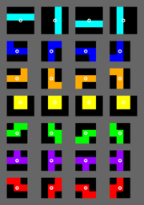

# Tetris 

This project contains a Ruby implementation (or part of the implementation) of the famous game Tetris, starting with object design and the separation of concerns.

# References
 * Tetrominoe Rotation System: http://tetris.wikia.com/wiki/SRS
 * Tetris Game Mechanics: https://tetris.fandom.com/wiki/Tetris_Guideline

# Rotation Graph

 

# Copyright

&copy; 2020 Konstantin Gredeskoul, All rights reserved.
